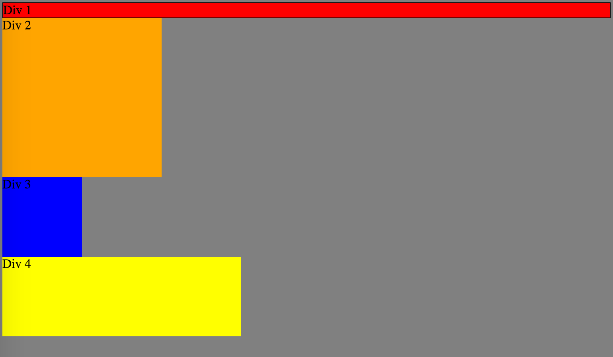

How can you use Chrome's DevTools inspector to help you format or position elements?
- It can help you real-time inspect the positioning of the elements by changing the properties.
How can you resize elements on the DOM using CSS?
-By changing the height x width properties of the box size of the elements on the DOM.
What are the differences between Absolute, Fixed, Static, and Relative positioning? Which did you find easiest to use? Which was most difficult?
- Absolute positioning will position elements anywhere on the browser window, fixed positioning will position the element in one location independent of the webpage contents(kind of like placing a sticker on your monitor screen and scrolling up and down a page). Static positioning is the deafault method placement of elements(new line). Relative positioning is when positioning away from the default static placement.
What are the differences between Margin, Border, and Padding?
-Margin is the space outside of your element, Border is the visible edge of the element, and padding is the space between the content(ie text) and the border.
What was your impression of this challenge overall? (love, hate, and why?)
-I hated and semi enjoyed it at the same time. It really forced me to get an understanding the different element positionings.