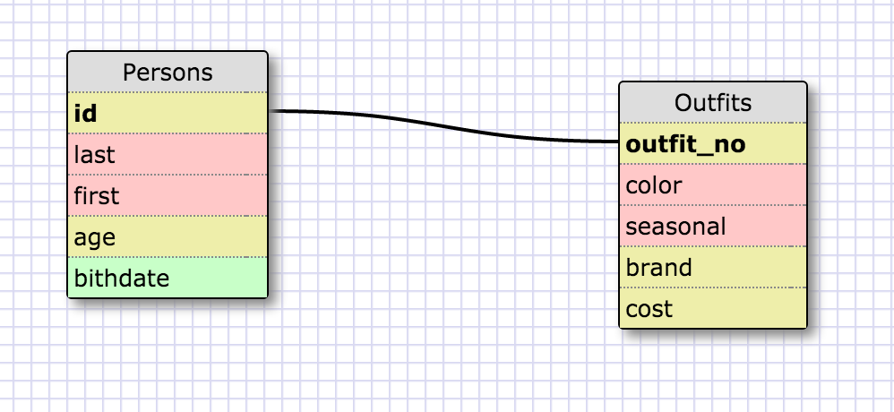

SELECT * FOR states;

SELECT id, region_name FROM regions;

SELECT state_name, population FROM states;

SELECT state_name, population
FROM states
ORDER BY population DESC;

SELECT state_name FROM states
WHERE region_id=7;

select state_name, population_density from states
where population_density > 50
order by population_density ASC;

select state_name from states
where population > 1000000
and population < 1500000;

select state_name, region_id from states
order by region_id asc;

select region_name from regions
where region_name LIKE '%central%';

select regions.region_name, states.state_name from regions, states
order by region_id asc;

#RELFECTION
What are databases for?
- Databases are used to track instances of information in tables. Their information is linked/related and are defined.
What is a one-to-many relationship?
-Its similar to a teacher to students relationship. There is only one teacher to many students.
What is a primary key? What is a foreign key? How can you determine which is which?
- A primary key is the unique key that exists in the primary table. All other tables which refer in relationship to that table refer it's foreign key to the primary table's primary key.  It can be a and ID number as a key, or a SSN, something unique.
How can you select information out of a SQL database? What are some general guidelines for that?
-You select information by following this syntax: SELECT column1, column 2 FROM table_name;
  It is important that you complete to execute your command with a semicolon. An astrisk can also be used in place of the column names to select ALL DATA from the table you specify.
