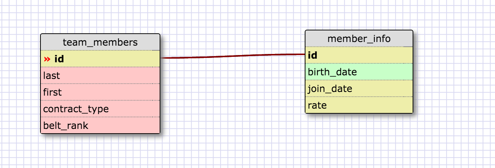
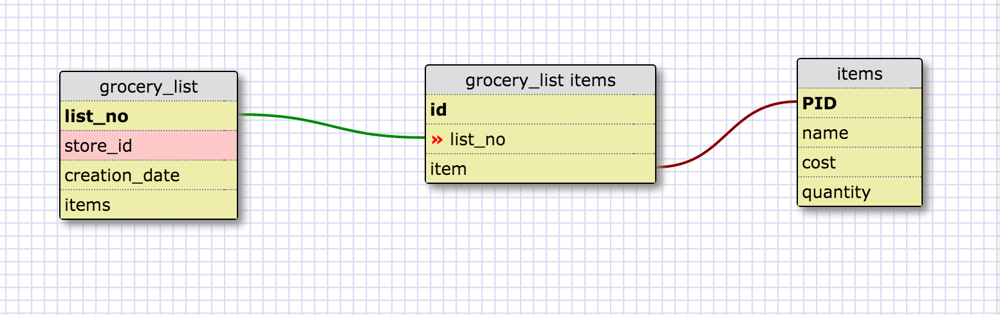

#Release 2

#Release 4

#Release 6: REFLECT
-What is a one-to-one database?
It is a database that has a single relationship (columns) to another table.
-When would you use a one-to-one database? (Think generally, not in terms of the example you created).
When there is only a single relationship between the two tables columns and when you want to perform faster queries.
-What is a many-to-many database?
Is a datatbase that has relationships to other tables that have other relationships.
-When would you use a many-to-many database? (Think generally, not in terms of the example you created).
Most of the time, we will use many-to many databases unless a one-to one is more efficient and necessary.
-What is confusing about database schemas? What makes sense?
I'm still going to have to some of my own research to see different schema models and their relationships.